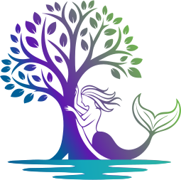
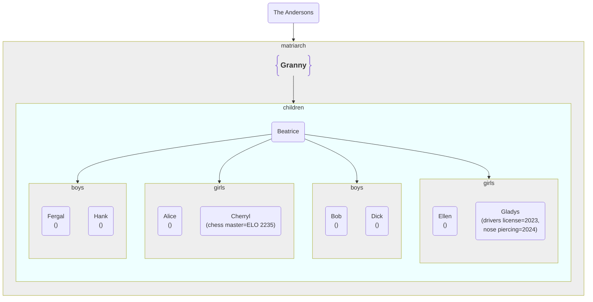

# gentry
 [](https://github.com/varkenvarken/gentrypy/actions/workflows/test_all.yml)  



**gentry** is a Python package for representing and manipulating generic tree structures with support for extensible child groups, visitor patterns, and convenient representations in the form of [Markdown](https://www.markdownguide.org/) / [Mermaid](https://mermaid.js.org/syntax/flowchart.html) diagrams.

The name **gentry** is a weak pun on 'generic tree' that is too lame to explain 😄 (See [Wikipedia](https://en.wikipedia.org/wiki/Gentry))

----
Table of contents
- [gentry](#gentry)
  - [Features](#features)
  - [Example Usage](#example-usage)
  - [Installation](#installation)
  - [License](#license)
  - [Documentation](#documentation)
  - [Project Structure](#project-structure)
  - [Contributions](#contributions)
----

## Features

The **gentry** package centers around a core [`gentry.tree.Tree`](gentry/tree.py) class and a reusable [`gentry.tree.Vistor`](gentry/tree.py) class.
A mixin class [`gentry.mermaid.Mermaid`](gentry/mermaid.py) is also provided.

The `Tree` class implements a node in a tree. It features

- a label
  
  that identifies a node, but that may be empty

- any number of children, organized in groups
  
  those children are implemented as a dict[str,list] and can be accessed via the `_children` atrribute, that will be initialized when
  instancing a node, but those groups of children will normally be accessed via group attributes (see next point). The `Visitor` class will iterate over all objects in `_children`, regardless which group they are in.

- group attributes
  
  a particular group of children can be accessed by using there name as an attribute to a node,
  by defining a class variable `_groups` with a set of group names when inheriting from `Tree`.
  See the section [Example Usage](#example-usage) for some examples.

- a `properties` attribute

  that should be a dict[str,Any] and can hold node specific arbitrary information.

The `Mermaid` mixin class can be added to the base classes when inheriting from `Tree`. 

It will add a `__str__()` method that will return Markdown containing a Mermaid block that presents the node and
all its children a graph.

It is a cooperative mixin, i.e. it depends on the existance of the `label`, `_children`, and `properties` attributes,
and its `__str__()` method will recursively create nodes and connectors for a `Tree` node and all its children. It will
put each group of children in its own frame. An example:



Individual nodes can be given distict shapes and styles, and the alternating colors of the frames can be configured as well.
See [Example Usage](#example-usage) for more.

Finally we have a `Visitor` class that can be inherited from to implement a visitor pattern. It can be given a `Tree` node and its children will be iterated over in depth-first fashion, after which the type of the node will be used to find a specific vistor method for that node type (a tree can have nodes of different types as long as the inherit from `Tree`), or default to a general visit method.

## Example Usage

This is the code that was used to generate the example diagram.
It can be found in [__main__.py](gentry/__main__.py)

It creates different subclasses of `Tree`, each with their own way of grouping children: a `Person` in general may simple group all their children using the attribute `children`, while `Mother`s are the exceptions and have different attributes for `boys` and `girls`.

A `GrandMother` also has a different node shape when rendered as a Mermaid graph, and a different style (Styles reflect to original purpose of the **gentry** package, i.e. Abstract Syntax Trees, so the have names like Shape.function)

For a `Child` we enable the display of properties in a Mermaid graph, but these are only set on some children (Cherryl and Gladys)

We also define a `FamilyCount` class that inherits from the `Count` class (provided in the package) that in turn inherits from the base `Visitor` class. It simply counts all nodes in a tree, but because we don't want to count a `Family` node as we would a `Person`, we provide a specialized `_do_count_Family()` method that simply returns 0.

The Mermaid diagram is produced in the final print statement. That's a one lines because it is implement in the `__str__()` method.

```python
from .tree import Tree, Count
from .mermaid import Mermaid, Shape, Style

class Family(Tree, Mermaid):...

class Person(Tree, Mermaid):
    _groups = { "children"}
    
class GrandMother(Person):
    _style = Style.function
    _shape = Shape.braces

class Mother(Person):
    _groups = {"girls", "boys"}
 
class Child(Person):
    _include_properties = True

class FamilyCount(Count):
    """
    We only count real persons, so we define a specialized member function
    for any Family node that returns 0 and will not be counted.
    """
    def _do_count_Family(self, tree:Family):
        return 0

# define a few children  
c1 = Child("Alice")
c2 = Child("Bob")
c3 = Child("Cherryl", properties={"chess master": "ELO 2235"})
c4 = Child("Dick")
c5 = Child("Ellen")
c6 = Child("Fergal")
c7 = Child("Gladys", properties={"drivers license": 2023, "nose piercing": 2024})
c8 = Child("Hank")

# Mothers have girls and boys attributes defined, so those can be assigned directly
m1 = Mother("Anna")
m1.girls = [c1,c3]
m1.boys = [c2,c4]

m2 = Mother("Beatrice")
m2.girls.append(c5)     # under the hood they are all items in a defaultdict(list) so we can append directly
m2.girls.append(c7)
m2.boys = [c6,c8]

# Grandmothers do not make the distinction
g1 = GrandMother("Granny")
g1.children = [m1, m2]
# so this would fail:
# g1.girls = [m1, m2]

# Family does not have any direct access attributes defined, but anything
# that is passed as the children argument (and can be converted to a defaultdict(list))
# will be added to the _children attribute, so will still be automatically discovered
# by Visitor derived classes.
f1 = Family("The Andersons", children={"matriarch":[g1]})

counter = FamilyCount(f1, strict=False)

assert counter.count() == 11

print(f1)
```

## Installation

```sh
pip install gentry
```

## License

This project is licensed under the [GNU GPLv3](LICENSE), with the exception of any artwork, including the logo, which are licensed under [CC BY-NC-ND 4.0.](https://creativecommons.org/licenses/by-nc-nd/4.0/)


## Documentation

The API documentation is a work in progress and can be found on 
https://varkenvarken.github.io/gentrypy/

## Project Structure

- [`gentry/tree.py`](gentry/tree.py): Core tree and visitor classes
- [`gentry/mermaid.py`](gentry/mermaid.py): Mermaid/Markdown mixin
- [`tests/`](tests/): Test suite, will be discovered automatically by VScode if [configured correctly](.vscode/settings.json), but can also be run from the command line with `pytest tests --cov=gentry --cov-report=xml`

The repository is a reflection of my Vscode environment and contains:

- [A Dev container configuration](.devcontainer/devcontainer.json) based on
- [A Dockerfile](./Dockerfile) that builds a Python 3.13.5 enviroment from source (because that is not yet provided as a feature), along with the necessary [dependencies](./requirements.txt) to test and record test coverage.

To package the **gentry** package [setup.py](./setup.py) is provided, which is used by a [GitHub action](.github/workflows/publish_package.yml) to package and publish to [pypi](https://pypi.org/project/gentry/) when a new release is tagged. 

## Contributions

Contributions are wellcome, either by suggesting improvements in [Issues](https://github.com/varkenvarken/gentrypy/issues), or even better, submitting a PR. 

Please make sure that any PR:

- is suitable for inclusion under a GPLv3 license
- passes all tests
- provides new unit tests if new functionality is implemented
- contains only code that is formatted by [black](https://github.com/psf/black) (in the future `pylint` compliance may be required as well )
